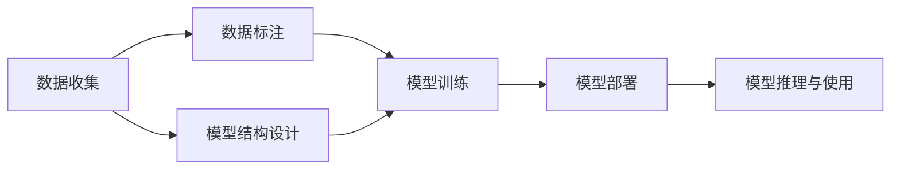

# 向量化模型（Embedding Model）

# （What）什么是向量表示模型？

# （Why）为什么需要向量表示模型？

# （How）怎么获得并使用向量表示模型？

向量表示模型训推应用流程图

向量模型的训练过程

向量模型的推理过程

向量

```mermaid
graph LR
    A["数据收集"] --> B["数据标注"]
    A --> C["模型结构设计"]
    B --> D["模型训练"]
    C --> D
    D --> E["模型部署"]
    E --> F["模型推理与使用"]
```

# （Do）实践项目